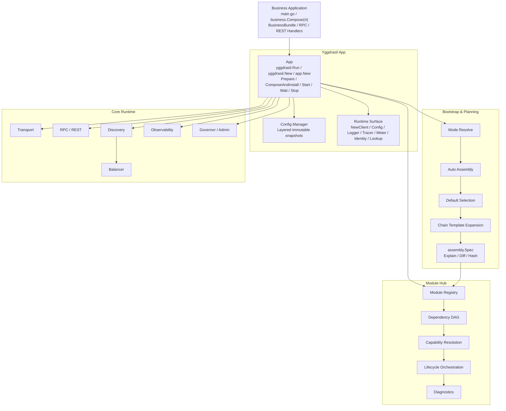
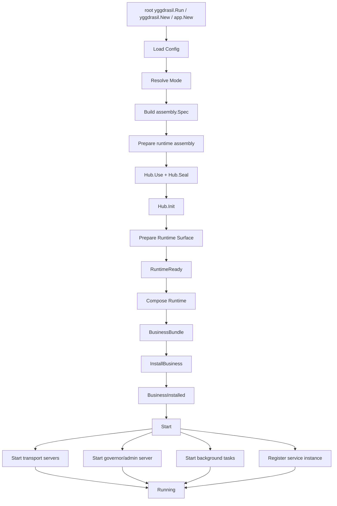
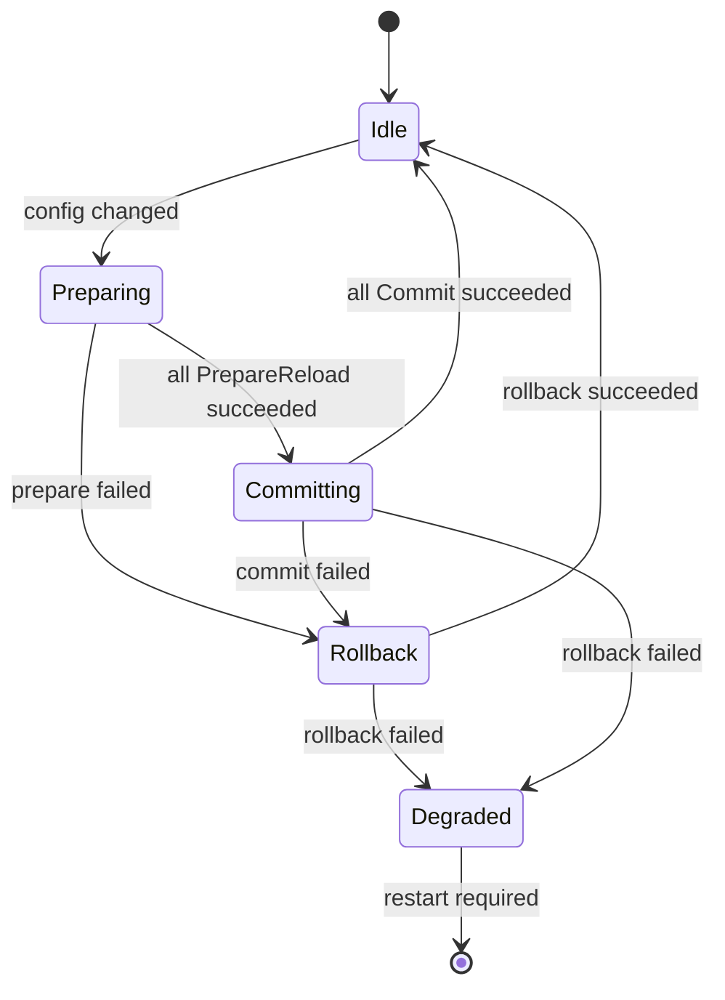

# Yggdrasil v3

[简体中文](README_zh_CN.md) · [Documentation](docs/en/README.md)

Yggdrasil v3 is a modular Go microservice framework built around an explicit `App + Hub + Module + Capability` runtime model. It provides declarative auto assembly, lifecycle-safe runtime preparation, RPC / REST service exposure, service discovery, load balancing, observability, hot reload, and a formal boundary for business composition and installation.

Yggdrasil is designed for teams that want both a strict, diagnosable framework kernel and a practical bootstrap experience for day-to-day service development.

```text
yggdrasil.Run -> business.Compose -> Wait
```

Yggdrasil's default bootstrap path is explicit: each application is composed through an `App` instance, a unified Module Hub, typed capabilities, and a planned runtime assembly model. The core runtime is App-local by default; `yggdrasil.Run` may install process-default compatibility facades for main programs, while `yggdrasil.New` and `app.New` keep process globals untouched unless `WithProcessDefaults(true)` is set. Some lower-level subsystem packages still expose compatibility provider registries, but business applications should wire framework behavior through the root facade, `App` options, modules, and capability registrations instead of hidden `init()` side effects.

---

## Why Yggdrasil?

Yggdrasil is useful when service runtime correctness matters as much as developer ergonomics.

- **Explicit composition**: every service is assembled through an independent `App` instance with App-local runtime state by default.
- **Unified module system**: logging, transport, registry, discovery, interceptors, and observability are managed by the `Hub`.
- **Typed capability model**: capabilities are resolved through explicit contracts and cardinality rules, never by “take the first provider.”
- **Deterministic auto assembly**: configuration, mode, overrides, and chain templates compile into a stable `assembly.Spec`.
- **Safe lifecycle semantics**: startup compensation, idempotent stop, graceful shutdown, and staged reload.
- **Runtime-ready business composition**: business code obtains clients, logger, config, tracer, and meter after infrastructure is prepared.
- **DI-agnostic**: business code may use Wire, Fx, hand-written constructors, or any other dependency organization strategy as long as it returns a `BusinessBundle`.

---

## Core Features

| Area | Capability |
| --- | --- |
| Application lifecycle | `Prepare`, `Compose`, `Install`, `Start`, `Wait`, `Stop`, graceful shutdown |
| Module system | `Hub`, dependency DAG, topological lifecycle order, diagnostics |
| Capability model | `ExactlyOne`, `OptionalOne`, `Many`, `OrderedMany`, `NamedOne` |
| Auto assembly | mode resolution, module selection, default provider selection, chain template expansion |
| Configuration | layered snapshots, priority merge, scoped views, watch-based reload |
| Business composition | `Runtime`, `BusinessBundle`, RPC / REST / Raw HTTP, tasks, hooks |
| Transport | protocol-agnostic server/client providers |
| Discovery | registry, resolver, balancer abstractions |
| Observability | logger, tracer, meter, stats handler integration |
| Diagnostics | explain, dry-run, spec diff, plan hash, module and reload state |

---

## Architecture Overview



For the full architecture, see [Architecture Overview and Design Principles](docs/en/01-architecture-overview-and-design-principles.md).

---

## Startup Flow



See [Application Lifecycle and Business Composition](docs/en/04-application-lifecycle-and-business-composition.md) for details.

---

## Quick Start

```go
package main

import (
    "context"
    "log/slog"
    "os"

    "github.com/codesjoy/yggdrasil/v3"
    "example.com/order/internal/business"
)

func main() {
    if err := yggdrasil.Run(
        context.Background(),
        business.Compose,
        yggdrasil.WithConfigPath("app.yaml"),
    ); err != nil {
        slog.Error("run app", slog.Any("error", err))
        os.Exit(1)
    }
}
```

Replace the `business` import with your service's package. The root `yggdrasil` facade is the default service entry. Use `app.New(...)->NewClient(...)` when you need a standalone client bootstrap or `app.New(...)->Start(...)` when you need explicit lifecycle control.

Runnable quickstart:

```sh
cd examples
go run ./01-quickstart/server
```

Example business composition:

```go
func Compose(rt yggdrasil.Runtime) (*yggdrasil.BusinessBundle, error) {
    userClient, err := rt.NewClient(context.Background(), "user-service")
    if err != nil {
        return nil, err
    }

    svc := &OrderService{
        Users:  userClient,
        Logger: rt.Logger(),
    }

    return &yggdrasil.BusinessBundle{
        RPCBindings: []yggdrasil.RPCBinding{{
            ServiceName: "OrderService",
            Desc:        orderpb.OrderServiceDesc,
            Impl:        svc,
        }},
    }, nil
}
```

---

## Configuration Example

```yaml
yggdrasil:
  mode: prod-grpc
  app:
    name: order-service

  server:
    transports:
      - "grpc"

  transports:
    grpc:
      server:
        address: ":9090"
    http:
      rest:
        host: "0.0.0.0"
        port: 8080

  observability:
    logging:
      handlers:
        default:
          type: json
      writers:
        default:
          type: console
    telemetry:
      tracer: otel
      meter: otel

  discovery:
    registry:
      type: multi_registry

  extensions:
    interceptors:
      unary_server: default-observable@v1

  overrides:
    force_defaults:
      observability.logger.handler: json
    disable_modules:
      - observability.stats.otel
```

See [Configuration, Declarative Assembly, and Hot Reload](docs/en/05-configuration-declarative-assembly-and-hot-reload.md).

---

## Key Concepts

### App

`App` is the lifecycle root. It owns configuration, planning, module hub, runtime assembly, business installation, start, wait, stop, and reload coordination.

### Module Hub

`Hub` registers modules, validates dependency DAGs, collects capabilities, resolves providers, drives module lifecycle, and exposes diagnostics. See [Module Hub and Capability Model](docs/en/02-module-hub-and-capability-model.md).

### Capability

A capability is a typed contract exposed by a module. Each capability declares name, type, and cardinality. This makes provider selection deterministic and diagnosable.

### Assembly Spec

The public planning type is `assembly.Spec`. It is the declarative plan produced by Bootstrap / Planning and is the source of truth for explain, dry-run, diff, hash, and reload classification. See [Bootstrap, Auto Assembly, and Planning](docs/en/03-bootstrap-auto-assembly-and-planning.md).

### Runtime

`Runtime` is the narrow surface exposed to business code after `Prepare()` succeeds. It allows business code to create clients and access config/logger/tracer/meter without exposing the entire App or Hub.

### BusinessBundle

`BusinessBundle` is the formal installation boundary for business code. It contains RPC bindings, REST bindings, raw HTTP handlers, background tasks, hooks, extensions, and diagnostics.

---

## Hot Reload

Yggdrasil uses immutable config snapshots, assembly spec diffing, and staged module reload.



Changes that affect the business graph, module set, or non-reloadable modules are marked `restart-required` instead of being hot-swapped implicitly.

---

## Documentation

### English

- [Documentation index](docs/en/README.md)
- [Glossary](docs/en/00-glossary.md)
- [Architecture Overview and Design Principles](docs/en/01-architecture-overview-and-design-principles.md)
- [Module Hub and Capability Model](docs/en/02-module-hub-and-capability-model.md)
- [Bootstrap, Auto Assembly, and Planning](docs/en/03-bootstrap-auto-assembly-and-planning.md)
- [Application Lifecycle and Business Composition](docs/en/04-application-lifecycle-and-business-composition.md)
- [Configuration, Declarative Assembly, and Hot Reload](docs/en/05-configuration-declarative-assembly-and-hot-reload.md)
- [Transport, Service Discovery, and Observability](docs/en/06-transport-discovery-and-observability.md)
- [Developer Practices and Extension Guide](docs/en/07-developer-practices-and-extension-guide.md)
- [Implementation Boundaries and Optimization Notes](docs/en/08-implementation-boundaries-and-optimization-notes.md)

### Chinese

- [中文文档索引](docs/zh_CN/README.md)

### Examples and References

- [Runnable examples](examples/README.md)
- [Module Hub diagnostics schema](docs/schemas/module-hub-diagnostics.schema.json)
- [Configuration layers recipe](examples/90-recipes/config-layers.md)
- [Raw gRPC recipe](examples/90-recipes/raw-grpc.md)
- [JSON raw gRPC recipe](examples/90-recipes/jsonraw-grpc.md)

---

## Development Guidelines

- Use `DependsOn()` for hard dependencies; do not encode them with `InitOrder()`.
- Keep `Prepare()` free of external serving actions such as listen, accept, or register-instance.
- Make `Stop()` idempotent.
- Treat capability conflicts as errors.
- Put business services, handlers, tasks, and hooks into `BusinessBundle`, not the Hub.
- Use versioned chain templates for default interceptor/middleware stacks.
- Mark business graph changes as restart-required during reload.

See [Developer Practices and Extension Guide](docs/en/07-developer-practices-and-extension-guide.md).

---

## Status

Yggdrasil v3 focuses on a strict modular kernel plus a practical high-level bootstrap path:

```text
explicit kernel + planned assembly + runtime-ready business composition
```
