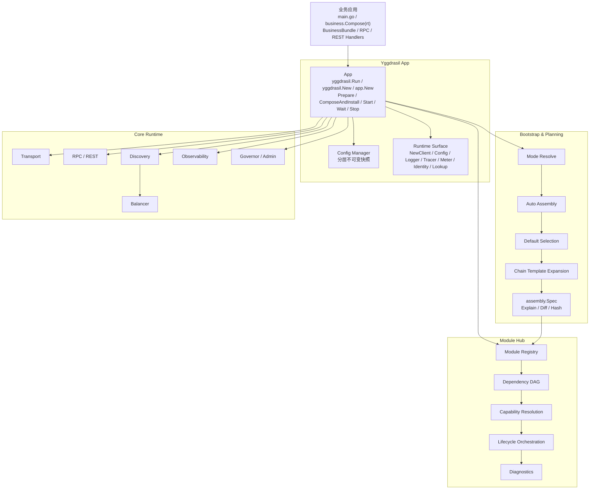
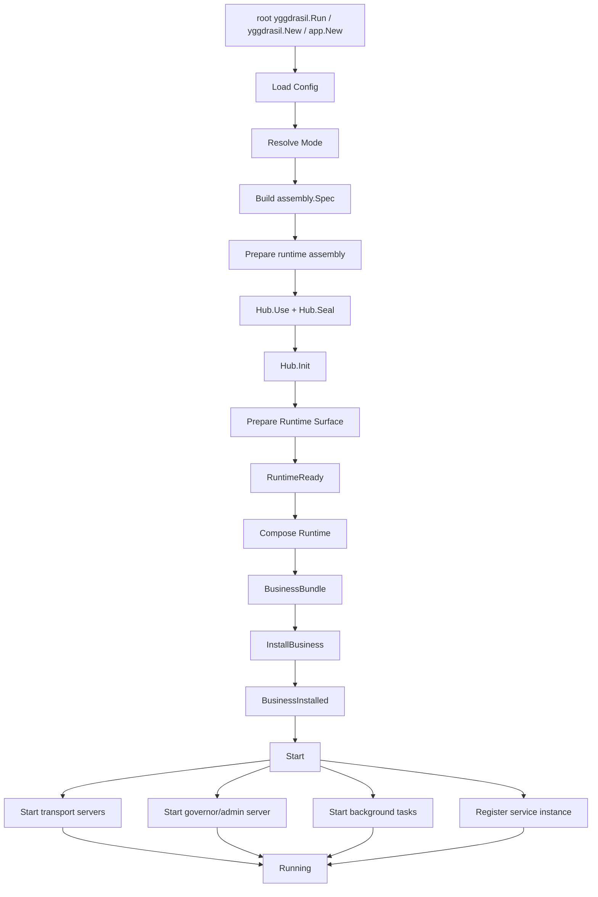
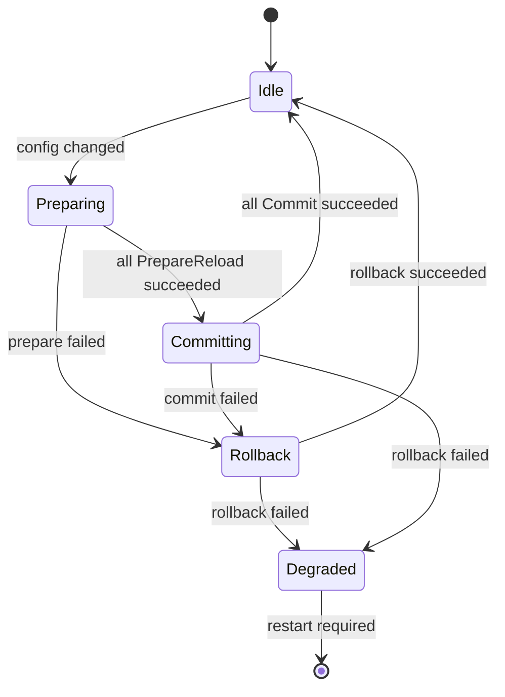

# Yggdrasil v3

[English](README.md) · [中文文档](docs/zh_CN/README.md)

Yggdrasil v3 是一个面向 Go 微服务应用的模块化框架。它以显式的 `App + Hub + Module + Capability` 运行时模型为核心，提供声明式自动装配、安全的运行时准备阶段、RPC / REST 服务暴露、服务发现、负载均衡、可观测性、热重载，以及正式的业务组合与安装边界。

Yggdrasil 面向同时关注 **运行时正确性** 与 **业务开发体验** 的服务开发场景。

```text
yggdrasil.Run -> business.Compose -> Wait
```

Yggdrasil 的默认 Bootstrap 路径是显式的：每个应用都通过一个明确的 `App` 实例作为组合根，通过统一模块中心、类型化 Capability 和可规划的运行时装配模型完成启动。内核默认使用 App-local runtime；`yggdrasil.Run` 可为 main 程序安装进程默认兼容 facade，而 `yggdrasil.New` 与 `app.New` 默认不改写进程全局状态，除非显式设置 `WithProcessDefaults(true)`。部分底层子系统仍保留兼容用的 provider registry；业务应用应优先通过 root facade、`App` options、模块和 capability registration 装配框架行为，而不是依赖隐藏的 `init()` 副作用。

---

## 为什么选择 Yggdrasil？

Yggdrasil 适合那些既需要框架内核严格可诊断，又希望业务开发路径足够简单的团队。

- **显式组合**：每个服务都通过独立 `App` 实例装配，默认持有 App-local runtime 状态。
- **统一模块系统**：日志、传输、注册中心、服务发现、拦截器、可观测性等基础能力统一由 `Hub` 管理。
- **类型化 Capability 模型**：能力通过明确契约与基数规则解析，不做“取第一个”的隐式选择。
- **确定性自动装配**：配置、mode、override 和链模板最终编译为稳定的 `assembly.Spec`。
- **安全生命周期语义**：启动失败补偿、幂等停止、优雅关闭、staged reload。
- **RuntimeReady 后业务组合**：业务实现可以在基础设施准备完成后，安全获取 client、logger、config、tracer、meter，再安装到框架中。
- **不绑定 DI 框架**：业务可以使用 Wire、Fx、手写构造函数或任意依赖组织方式，只要最终产出 `BusinessBundle`。

---

## 核心特性

| 领域 | 能力 |
| --- | --- |
| 应用生命周期 | `Prepare`、`Compose`、`Install`、`Start`、`Wait`、`Stop`、优雅关闭 |
| 模块系统 | `Hub`、依赖 DAG、拓扑生命周期顺序、诊断信息 |
| Capability 模型 | `ExactlyOne`、`OptionalOne`、`Many`、`OrderedMany`、`NamedOne` |
| 自动装配 | mode 解析、模块选择、默认 provider 选择、链模板展开 |
| 配置系统 | 分层快照、优先级合并、Scoped View、watch 热更新 |
| 业务组合 | `Runtime`、`BusinessBundle`、RPC / REST / Raw HTTP、tasks、hooks |
| 传输层 | 协议无关的 server/client provider |
| 服务发现 | registry、resolver、balancer 抽象 |
| 可观测性 | logger、tracer、meter、stats handler 集成 |
| 诊断能力 | explain、dry-run、spec diff、plan hash、模块与 reload 状态 |

---

## 架构概览



完整设计见 [架构总览与设计原则](docs/zh_CN/01-架构总览与设计原则.md)。

---

## 启动流程



详见 [应用生命周期与业务组合](docs/zh_CN/04-应用生命周期与业务组合.md)。

---

## 快速开始

```go
package main

import (
    "context"
    "log/slog"
    "os"

    "github.com/codesjoy/yggdrasil/v3"
    "example.com/order/internal/business"
)

func main() {
    if err := yggdrasil.Run(
        context.Background(),
        "order-service",
        business.Compose,
        yggdrasil.WithConfigPath("app.yaml"),
    ); err != nil {
        slog.Error("run app", slog.Any("error", err))
        os.Exit(1)
    }
}
```

将 `business` import 替换为你的服务包路径。root `yggdrasil` facade 是默认服务入口；app name 由 `Run` / `New` 显式传入，不再从配置读取。需要独立 client bootstrap 时使用 `app.New(appName, ...)->NewClient(...)`，需要显式生命周期控制时再使用 `app.New(appName, ...)->Start(...)`。

可直接运行的 quickstart：

```sh
cd examples
go run ./01-quickstart/server
```

业务组合示例：

```go
func Compose(rt yggdrasil.Runtime) (*yggdrasil.BusinessBundle, error) {
    userClient, err := rt.NewClient(context.Background(), "user-service")
    if err != nil {
        return nil, err
    }

    svc := &OrderService{
        Users:  userClient,
        Logger: rt.Logger(),
    }

    return &yggdrasil.BusinessBundle{
        RPCBindings: []yggdrasil.RPCBinding{{
            ServiceName: "OrderService",
            Desc:        orderpb.OrderServiceDesc,
            Impl:        svc,
        }},
    }, nil
}
```

---

## 配置示例

```yaml
yggdrasil:
  mode: prod-grpc

  server:
    transports:
      - "grpc"

  transports:
    grpc:
      server:
        address: ":9090"
    http:
      rest:
        host: "0.0.0.0"
        port: 8080

  observability:
    logging:
      handlers:
        default:
          type: json
      writers:
        default:
          type: console
    telemetry:
      tracer: otel
      meter: otel

  discovery:
    registry:
      type: multi_registry

  extensions:
    interceptors:
      unary_server: default-observable@v1

  overrides:
    force_defaults:
      observability.logger.handler: json
    disable_modules:
      - observability.stats.otel
```

详见 [配置、声明式装配与热重载](docs/zh_CN/05-配置声明式装配与热重载.md)。

配置可以由文件、环境变量、命令行参数和程序化 source 分层组成。未加载配置文件、bootstrap source 或程序化配置 source 时，Yggdrasil 会安装默认 `YGGDRASIL` 环境变量 source 和默认命令行 flag source。启动期配置 source 可通过 `YGGDRASIL_CONFIG_SOURCES` 或 `--yggdrasil-config-sources` 声明，支持 JSON object、JSON array，以及 `kind:name:priority` 紧凑格式。

---

## 核心概念

### App

`App` 是生命周期组合根，负责配置、规划、模块中心、运行时装配、业务安装、启动、等待、停止与 reload 协调。

### Module Hub

`Hub` 负责注册模块、校验依赖 DAG、收集 Capability、解析 provider、驱动模块生命周期并暴露诊断信息。详见 [模块中心 Hub 与 Capability 模型](docs/zh_CN/02-模块中心Hub与Capability模型.md)。

### Capability

Capability 是模块暴露的类型化能力契约，每个能力都声明名称、类型与基数规则，使 provider 选择可确定、可诊断。

### Assembly Spec

当前公共规划类型是 `assembly.Spec`。它是 Bootstrap / Planning 产出的声明式计划，是 explain、dry-run、diff、hash 和 reload 分类的唯一真相源。详见 [Bootstrap 自动装配与规划系统](docs/zh_CN/03-Bootstrap自动装配与规划系统.md)。

### Runtime

`Runtime` 是 `Prepare()` 成功后暴露给业务代码的窄接口。业务通过它创建 client，访问 config、logger、tracer、meter，而不是获取完整 App 或 Hub。

### BusinessBundle

`BusinessBundle` 是业务代码进入框架的正式安装边界，包含 RPC 绑定、REST 绑定、Raw HTTP、后台任务、生命周期 Hook、扩展安装项和诊断信息。

---

## 热重载

Yggdrasil 使用不可变配置快照、装配计划 diff 和模块 staged reload 实现可控热重载。



涉及业务图、模块集合或不可热更新模块的变化，会标记为 `restart-required`，不会隐式热替换。

---

## 文档

### 中文

- [中文文档索引](docs/zh_CN/README.md)
- [术语表](docs/zh_CN/00-术语表.md)
- [架构总览与设计原则](docs/zh_CN/01-架构总览与设计原则.md)
- [模块中心 Hub 与 Capability 模型](docs/zh_CN/02-模块中心Hub与Capability模型.md)
- [Bootstrap 自动装配与规划系统](docs/zh_CN/03-Bootstrap自动装配与规划系统.md)
- [应用生命周期与业务组合](docs/zh_CN/04-应用生命周期与业务组合.md)
- [配置、声明式装配与热重载](docs/zh_CN/05-配置声明式装配与热重载.md)
- [传输、服务发现与可观测性](docs/zh_CN/06-传输服务发现与可观测性.md)
- [开发者实践与扩展指南](docs/zh_CN/07-开发者实践与扩展指南.md)
- [实施边界与优化补充](docs/zh_CN/08-实施边界与优化补充.md)

### English

- [English documentation index](docs/en/README.md)

### 示例与参考

- [可运行示例](examples/README_zh_CN.md)
- [Module Hub diagnostics schema](docs/schemas/module-hub-diagnostics.schema.json)
- [配置分层 recipe](examples/90-recipes/config-layers_zh_CN.md)
- [Raw gRPC recipe](examples/90-recipes/raw-grpc_zh_CN.md)
- [JSON raw gRPC recipe](examples/90-recipes/jsonraw-grpc_zh_CN.md)

---

## 开发约定

- 强依赖使用 `DependsOn()`，不要用 `InitOrder()` 表达。
- `Prepare()` 阶段不得执行 listen、accept、register-instance 等对外服务动作。
- `Stop()` 必须幂等。
- Capability 冲突必须视为错误。
- 业务服务、handler、task、hook 进入 `BusinessBundle`，不要进入 Hub。
- 默认 interceptor / middleware 栈使用版本化链模板。
- reload 中涉及业务图变化时标记 `restart-required`。

详见 [开发者实践与扩展指南](docs/zh_CN/07-开发者实践与扩展指南.md)。

---

## 状态

Yggdrasil v3 的核心方向是严格模块化内核与实用高层 Bootstrap 路径的结合：

```text
显式内核 + 可规划装配 + RuntimeReady 后业务组合
```
