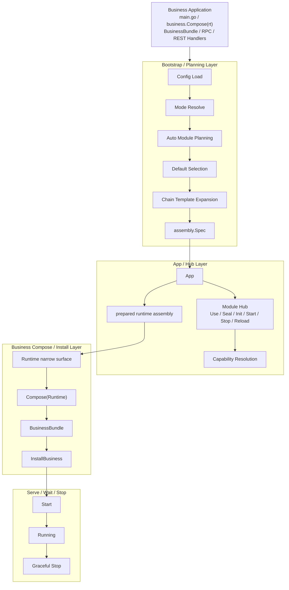

# 01. Yggdrasil v3 Architecture Overview and Design Principles

> This document is part of the Yggdrasil v3 documentation set. It summarizes the framework architecture, design intent, and boundaries for developers, module authors, and maintainers.
>
> Keywords: App, Hub, Module, Capability, assembly.Spec, prepared runtime assembly, Prepare, Compose, BusinessBundle, Staged Reload.

## 1. Framework Positioning

Yggdrasil is a Go microservice framework built around explicit runtime composition. The default application path is centered on an `App` instance and a Module Hub instead of process-wide business composition, and it is not tied to any specific dependency injection container. The kernel uses App-local runtime state; process-default logger, OTel provider, and legacy instance facades are optional compatibility entry points and must not be read implicitly by core runtime paths.

Its core goals are to:

- provide a stable runtime for RPC and REST services;
- use a unified module hub to manage infrastructure capabilities such as logging, transport, registry, discovery, balancing, and observability;
- compile configuration, module selection, default providers, and extension-chain templates into an auditable assembly plan;
- introduce a formal business composition stage after the runtime is ready, so business implementations can safely construct downstream clients and install service bindings.

## 2. High-Level Architecture



The architecture is built on two separations:

1. **Plan versus instance**: `assembly.Spec` is the public declarative plan used for explain, diff, and hash. The prepared runtime assembly is an internal in-memory instance graph.
2. **Framework kernel versus business graph**: modules and providers are registered in the Hub. Business service implementations, handlers, tasks, and hooks are installed through `BusinessBundle`, not registered as Hub modules.
3. **App-local versus process-default**: `app.New` and `yggdrasil.New` leave process globals untouched by default. `yggdrasil.Run` targets a single-main-App program and may install compatibility process defaults. At most one App can own process defaults at a time.

## 3. Main Layers

| Layer | Responsibility | Typical objects |
| --- | --- | --- |
| Entry layer | Create App, load bootstrap inputs, expose high-level APIs | `yggdrasil.Run`, `yggdrasil.New`, `app.New` |
| Planning layer | Resolve mode, select modules, choose defaults, expand chain templates | `assembly.Spec`, `assembly.Decision` |
| Container layer | Register modules, validate DAG, validate capabilities, coordinate lifecycle | `module.Hub` |
| Runtime preparation layer | Build client manager, server objects, resolver/balancer runtime, observability runtime | prepared runtime assembly, `Runtime` |
| Business composition layer | Construct business implementations and install RPC/REST/HTTP/task/hook bindings | `BusinessBundle` |
| Serving layer | Listen, register instances, wait, shutdown, reload | `Start`, `Wait`, `Stop`, `Reload` |

## 4. Design Principles

### 4.1 The kernel defines structure, not business capability enums

The kernel provides `App`, `Hub`, `Module`, lifecycle interfaces, dependency declarations, and capability resolution helpers. Concrete capabilities such as logging, transport, registry, resolver, balancer, and interceptors are owned by their subsystems.

### 4.2 Module order and call-chain order are separate concepts

- Module init/start/stop order comes from the explicit dependency DAG.
- RPC interceptors and REST middleware order comes from configuration or expanded chain templates.
- `InitOrder()` is only a tie-breaker within the same DAG layer. It must not express hard dependencies.

### 4.3 Implicit assembly must produce an explicit plan

Every automatic choice must be recorded in `assembly.Spec`: enabled modules, selected defaults, expanded chain templates, and decision sources. This makes dry-run, explain, diff, and reload deterministic.

### 4.4 Hub manages long-lived modules, not high-frequency runtime objects

The Hub is appropriate for logger providers, transport providers, registry providers, interceptor providers, and other long-lived objects. It must not manage per-request objects, per-stream objects, endpoint connections, pickers, or resolver watches.

### 4.5 Failure semantics must be explicit

- Startup failures must stop already-started modules in reverse order.
- `Stop()` must be idempotent.
- Reload uses staged reload; implicit partial commit is not allowed.
- Capability conflicts must fail fast; the framework must never silently choose “the first provider.”
- Rollback failures must enter degraded / restart-required state instead of retrying indefinitely.

## 5. Suggested Package Layout

```text
yggdrasil/
  app/                  # App lifecycle, business install, reload, public facade
  assembly/             # Plan / DryRun / Spec / Diff / Hash / Explain
  module/               # Hub, Module, DAG, Capability, Lifecycle, Scope
  config/               # Manager, Snapshot, View, Source
  transport/            # Protocol-agnostic transport contracts and providers
  transport/protocol/   # gRPC, HTTP, and other protocol implementations
  transport/runtime/    # Client/server runtime orchestration and balancing
  discovery/            # Registry and resolver contracts
  observability/        # Logger, OpenTelemetry, stats
  admin/                # Governor and diagnostics
```

## 6. Stable API and Internal Boundaries

The `app` package keeps the stable public API and all `func (a *App)` methods. Implementation-heavy helpers should remain under `app/internal/*`:

```text
app
  -> app/internal/assembly
  -> app/internal/bootstrap
  -> app/internal/install
  -> app/internal/lifecycle
  -> app/internal/runtime
```

This preserves public API stability while allowing internal implementation details to evolve.

## 7. Architectural Benefits

- Simpler default business path: `yggdrasil.Run -> business.Compose -> Wait`; `app.New -> Prepare -> ComposeAndInstall -> Start -> Wait` remains the advanced control path.
- Strict kernel semantics: DAG, capability cardinality, scope, and reload state are all validated.
- Auditable defaults: default selection and template expansion are explainable.
- Reliable reload: diff uses stable `assembly.Spec`, not runtime instance identity.
- Safer extensibility: new protocols, registries, resolvers, and middleware can be added without changing a central enum.
