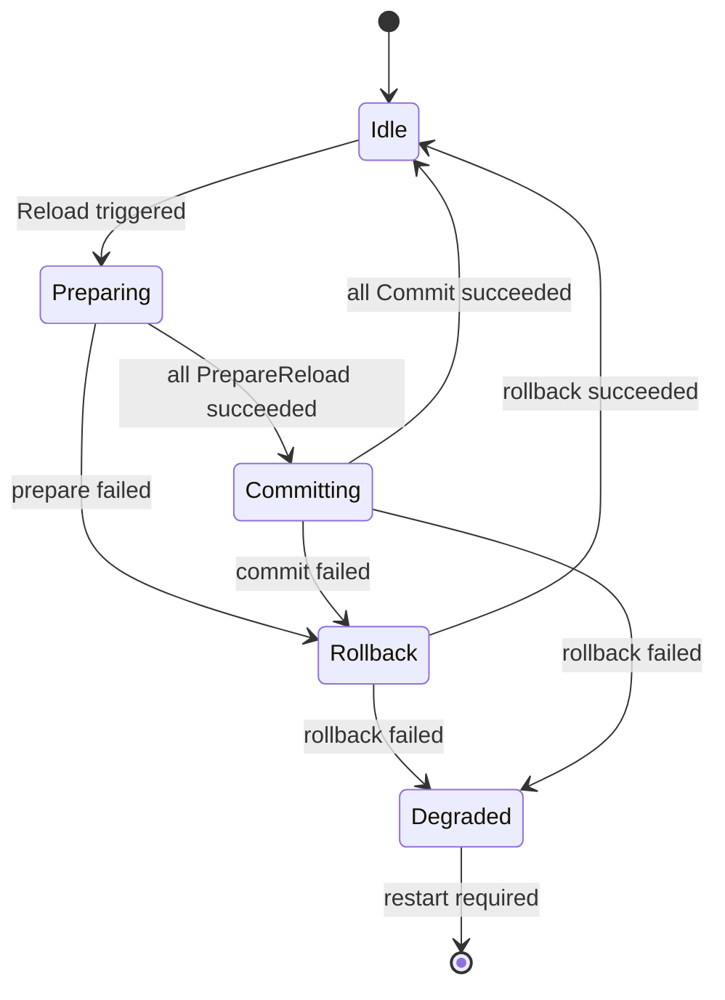

# 02. Module Hub and Capability Model

> This document describes the Yggdrasil Module Hub, module lifecycle, dependency ordering, capability model, scope boundary, and diagnostics contract.

## 1. Hub Responsibilities

`module.Hub` is the runtime composition core of Yggdrasil. It collects modules, builds a name index, validates the dependency DAG, runs lifecycle phases, collects capabilities, and exposes cardinality-aware resolution APIs.

The Hub does not own the business object graph and does not manage high-frequency runtime instances. It manages long-lived, low-frequency, diagnosable capability carriers.

## 2. Minimal Module Interface

```go
type Module interface {
    Name() string
}
```

Every other behavior is expressed through optional interfaces:

| Interface | Purpose |
| --- | --- |
| `Dependent` | Declares hard dependencies |
| `Ordered` | Orders modules within the same DAG layer |
| `Configurable` | Declares a configuration path |
| `Initializable` | Initializes long-lived resources |
| `Startable` | Starts serving behavior or background processes |
| `Stoppable` | Stops resources; must be idempotent |
| `Reloadable` | Supports staged reload |
| `CapabilityProvider` | Exposes capabilities |
| `AutoDescribed` | Participates in auto assembly |
| `Scoped` | Declares runtime lifetime scope |

## 3. Dependency DAG and Topological Order

Modules declare hard dependencies through `DependsOn()`:

```go
type Dependent interface {
    DependsOn() []string
}
```

Sorting rules:

1. Collect all module names and build an index.
2. Read `DependsOn()` and build a directed graph.
3. Validate that every dependency target exists.
4. Run Kahn's algorithm for topological sorting.
5. Sort modules in the same layer by `InitOrder()` ascending, then module name.
6. If a cycle exists, report the full cycle path.

Human-readable errors are required:

```text
module dependency cycle detected:
logger.default -> tracer.default -> server.default -> logger.default
```

```text
module "server.default" depends on missing module "stats.default"
available modules: logger.default, tracer.default, otel.stats
```

## 4. Lifecycle Semantics

### 4.1 Init

`Init(ctx, view)` is called in topological order. If a module implements `Configurable`, the Hub provides a scoped config view based on `ConfigPath()`.

```go
func (m *MyModule) ConfigPath() string { return "yggdrasil.my_module" }

func (m *MyModule) Init(ctx context.Context, view config.View) error {
    var cfg MyConfig
    if err := view.Decode(&cfg); err != nil {
        return err
    }
    return nil
}
```

### 4.2 Start and Compensation

`Start` runs in topological order. If a module fails to start, the Hub stops all successfully started modules in reverse order:

```text
start A -> start B -> start C failed -> stop B -> stop A
```

Compensation must continue even if one stop operation fails. Stop errors should be aggregated.

### 4.3 Stop

`Stop` runs in reverse topological order and calls only modules implementing `Stoppable`. `Stop()` must be idempotent. A typical implementation uses `sync.Once`:

```go
func (m *myModule) Stop(ctx context.Context) error {
    m.stopOnce.Do(func() {
        m.stopErr = m.closeResources(ctx)
    })
    return m.stopErr
}
```

### 4.4 Reload

Reload follows a staged protocol:



- Prepare phase: affected modules prepare the next state.
- Commit phase: all prepared modules commit in a stable order.
- Rollback phase: prepared but uncommitted state is rolled back on failure.
- Degraded state: rollback failure or state divergence requires external restart.

## 5. Capability Model

Capabilities are typed contracts between modules. A module publishes capability values; consumers resolve them through the Hub by spec.

```go
type CapabilitySpec struct {
    Name        string
    Cardinality CapabilityCardinality
    Type        reflect.Type
}

type Capability struct {
    Spec  CapabilitySpec
    Name  string
    Value any
}
```

### 5.1 Cardinality Rules

| Cardinality | Meaning | Typical usage |
| --- | --- | --- |
| `ExactlyOne` | Exactly one provider is required | logger handler, registry provider |
| `OptionalOne` | Zero or one provider | optional writer, optional profiler |
| `Many` | Zero or more providers, no order semantics | transport providers, stats handlers |
| `OrderedMany` | Multiple providers ordered by configuration | interceptors, middleware |
| `NamedOne` | One provider per unique name | named resolver, named balancer |

### 5.2 Static Validation

During `Seal()`, the Hub validates:

- spec name is non-empty;
- capability value is non-nil;
- cardinality is consistent for the same capability name;
- type declaration is consistent;
- value type implements or is assignable to the spec type;
- `ExactlyOne`, `OptionalOne`, and `NamedOne` satisfy cardinality constraints.

### 5.3 Resolution APIs

The framework must not resolve by “first provider wins.” Every resolution call must express cardinality intent:

```go
func ResolveExactlyOne[T any](h *Hub, spec CapabilitySpec) (T, error)
func ResolveOptionalOne[T any](h *Hub, spec CapabilitySpec) (T, bool, error)
func ResolveMany[T any](h *Hub, spec CapabilitySpec) ([]T, error)
func ResolveNamed[T any](h *Hub, spec CapabilitySpec, name string) (T, error)
func ResolveOrdered[T any](h *Hub, spec CapabilitySpec, names []string) ([]T, error)
```

`ResolveOrdered` must also reject duplicates, missing provider names, and type mismatches in the configured list.

## 6. Scope Boundary

```go
type Scope int

const (
    ScopeApp Scope = iota
    ScopeProvider
    ScopeRuntimeFactory
)
```

- `ScopeApp`: lives for the whole App lifetime.
- `ScopeProvider`: exposes capabilities or factories, without owning high-frequency runtime instances.
- `ScopeRuntimeFactory`: creates objects dynamically by service, endpoint, or stream; must not be registered in the Hub.

The Hub should reject `ScopeRuntimeFactory` modules to prevent high-frequency dynamic objects from entering global lifecycle management.

## 7. Diagnostics

Hub diagnostics should include:

- module topological order and layer;
- dependency list for each module;
- started module set;
- capability conflicts;
- dependency errors;
- reload phase, failed module, failed stage, and last error;
- restart-required and degraded / diverged status.

Recommended structure:

```go
type ModuleDiag struct {
    Name                string
    DependsOn           []string
    TopoIndex           int
    TopoLayer           int
    Started             bool
    RestartRequired     bool
    ReloadPhase         string
    LastReloadError     string
    CapabilityConflicts []string
    DependencyErrors    []string
}
```

## 8. Custom Module Template

```go
type MyModule struct {
    cfg MyConfig
    stopOnce sync.Once
    stopErr error
}

func (m *MyModule) Name() string { return "my.module" }
func (m *MyModule) DependsOn() []string { return []string{"foundation.runtime"} }
func (m *MyModule) ConfigPath() string { return "yggdrasil.my_module" }

func (m *MyModule) Init(ctx context.Context, view config.View) error {
    var cfg MyConfig
    if err := view.Decode(&cfg); err != nil { return err }
    m.cfg = cfg
    return nil
}

func (m *MyModule) Start(ctx context.Context) error { return nil }

func (m *MyModule) Stop(ctx context.Context) error {
    m.stopOnce.Do(func() { m.stopErr = m.close(ctx) })
    return m.stopErr
}
```
