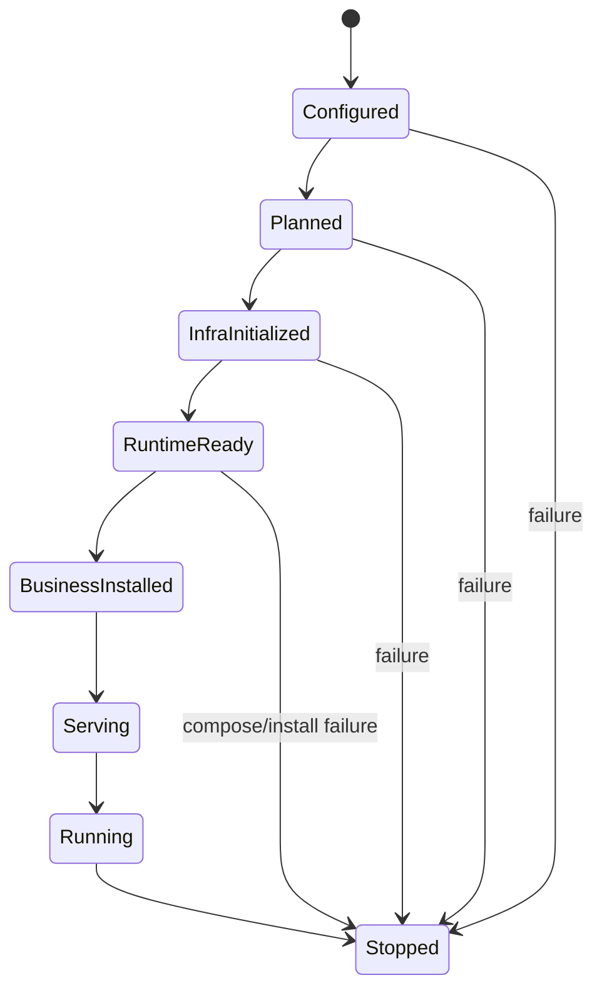

# 04. Application Lifecycle and Business Composition

> This document describes the App lifecycle, Runtime surface, BusinessBundle model, installation flow, and graceful shutdown semantics.

## 1. Lifecycle State Machine

Recommended high-level state machine:



The existing App state machine can also be expressed as:

```text
New -> Planned -> InfraInitialized -> Initialized -> BusinessInstalled -> Serving -> Running -> Stopped
```

`Stopped` is terminal. In-process restart is not supported.

## 2. Default and Advanced Entries

### 2.1 Default service entry

`yggdrasil.Run(ctx, compose, opts...)` is the recommended default onboarding path for services because it keeps business-facing entrypoints at the root facade while preserving the same `BusinessBundle` installation boundary underneath:

```text
yggdrasil.Run -> ComposeAndInstall -> Start -> Wait
```

This is the path application teams should see first.

### 2.2 Advanced lifecycle and client entry

`app.New(appName, ...)` remains the advanced control path when you need explicit `Prepare`, `Compose`, `Install`, `Start`, `Wait`, `Stop`, or a standalone client bootstrap such as `app.New(...)->NewClient(...)`.

## 3. Prepare Phase

`Prepare()` must complete:

- load configuration and produce a snapshot;
- compile settings / resolved configuration;
- resolve mode;
- build `assembly.Spec`;
- prepare the internal runtime assembly;
- call `Hub.Use(...) + Seal()`;
- call `Hub.Init()`;
- build runtime infrastructure required by compose/install;
- expose the narrow `Runtime` interface.

Hard constraints:

- must not `Listen / Serve / Accept`;
- must not register a service instance;
- must not receive business requests;
- may only start internal-only helpers;
- all external serving actions must be delayed until `Start()`.

## 4. Runtime Narrow Interface

`Runtime` is the recommended framework entry point during business composition. It is neither `*App` nor `*Hub`.

```go
type Runtime interface {
    NewClient(ctx context.Context, service string) (client.Client, error)
    Config() *config.Manager
    Logger() *slog.Logger
    TracerProvider() trace.TracerProvider
    MeterProvider() metric.MeterProvider
    Identity() yggdrasil.Identity
    Lookup(target any) error
}
```

Constraints:

- does not expose high-privilege operations such as `Stop`, `Reload`, `Hub`, or `Modules`;
- `Lookup(target)` only resolves business-safe runtime façades;
- no generic string-based capability query is exposed;
- business code should prefer `NewClient`, `Config`, `Logger`, `TracerProvider`, and `MeterProvider`.

## 5. Compose Phase

Business code composes its object graph through a callback:

```go
bundle, err := app.Compose(ctx, func(rt yapp.Runtime) (*yapp.BusinessBundle, error) {
    userClient, err := rt.NewClient(ctx, "user-service")
    if err != nil { return nil, err }

    svc := &OrderService{Users: userClient, Logger: rt.Logger()}

    return &yapp.BusinessBundle{
        RPCBindings: []yapp.RPCBinding{{
            ServiceName: "OrderService",
            Desc:        orderDesc,
            Impl:        svc,
        }},
    }, nil
})
```

The framework does not care whether business code uses Wire, Fx, hand-written factories, or another dependency organization method. The formal output must be `BusinessBundle`.

## 6. BusinessBundle

```go
type BusinessBundle struct {
    RPCBindings  []RPCBinding
    RESTBindings []RESTBinding
    RawHTTP      []RawHTTPBinding
    Tasks        []BackgroundTask
    Hooks        []BusinessHook
    Extensions   []BusinessInstallable
    Diagnostics  []BundleDiag
}
```

| Field | Purpose |
| --- | --- |
| `RPCBindings` | Register RPC / gRPC services |
| `RESTBindings` | Register REST gateway services |
| `RawHTTP` | Register raw HTTP handlers |
| `Tasks` | Background tasks managed by the lifecycle runner |
| `Hooks` | before-start, before-stop, and after-stop hooks |
| `Extensions` | Formal extension point beyond standard bindings |
| `Diagnostics` | Business diagnostics exposed through the framework |

## 7. InstallBusiness

`InstallBusiness(bundle)` installs the business composition result:

- validates RPC desc / impl type;
- validates REST desc / impl type;
- validates RawHTTP method/path/handler;
- checks service-name and route conflicts;
- registers tasks and hooks;
- executes `BusinessInstallable` extensions;
- collects diagnostics.

### 7.1 RPCBinding

```go
type RPCBinding struct {
    ServiceName string
    Desc        any // must be *server.ServiceDesc
    Impl        any // must satisfy desc.HandlerType
}
```

Validation: server transport exists; desc is non-nil; impl is non-nil; impl satisfies handler type; service name is unique.

### 7.2 RESTBinding

```go
type RESTBinding struct {
    Name     string
    Desc     any
    Impl     any
    Prefixes []string
}
```

Validation: REST is enabled; desc and impl are valid; method+path does not conflict with other REST or RawHTTP routes.

### 7.3 RawHTTPBinding

```go
type RawHTTPBinding struct {
    Method  string
    Path    string
    Handler any
    Desc    *server.RestRawHandlerDesc
}
```

Legacy desc normalization is supported. Otherwise method/path/handler are used directly.

## 8. Start / Serving / Running

`Start()` happens after business installation:

```text
Start
  -> before-start hooks
  -> Hub.Start
  -> finalize server registrations
  -> bind/listen/serve
  -> register service instance
  -> Running
```

Servers are started concurrently by the lifecycle runner. If any server fails, async stop is triggered.

## 9. Graceful Shutdown

Shutdown order:

```text
BeforeStop hooks
  -> Deregister from registry
  -> Stop servers
  -> Stop business tasks
  -> Cleanup hooks
  -> Hub.Stop
  -> Close config sources
  -> AfterStop hooks
```

The default shutdown timeout is 30 seconds and can be changed with `WithShutdownTimeout`.

## 10. Compose / Install Failure Compensation

If `Prepare` succeeds but `Compose` or `InstallBusiness` fails:

```text
rollback partially installed business resources
  -> stop compose-managed tasks/hooks/extensions
  -> close prepared runtime assembly resources
  -> Hub.Stop
  -> state = Stopped or InfraInitialized
```

Requirements:

- watchers, managers, exporters, and similar resources created by `Prepare()` must be closed through the prepared runtime assembly close path;
- local resources created inside `Compose` but not included in `BusinessBundle` are owned by business code;
- resources that must live across Start/Stop must enter `Tasks`, `Hooks`, or `Extensions`.

## 11. Two-Phase Contract for Transport / Provider Authors

To preserve the `Prepare()` no-serving contract, transport/provider implementations must follow a two-phase model.

### Prepare may

- create providers;
- create server objects;
- create handler registries, codecs, and muxes;
- create unbound listener state;
- start internal-only helpers.

### Prepare must not

- call `Listen`;
- call `Serve`;
- call `Accept`;
- register service instances;
- start external request worker loops.

### Start may

- bind/listen/serve;
- register instances;
- accept external requests.
