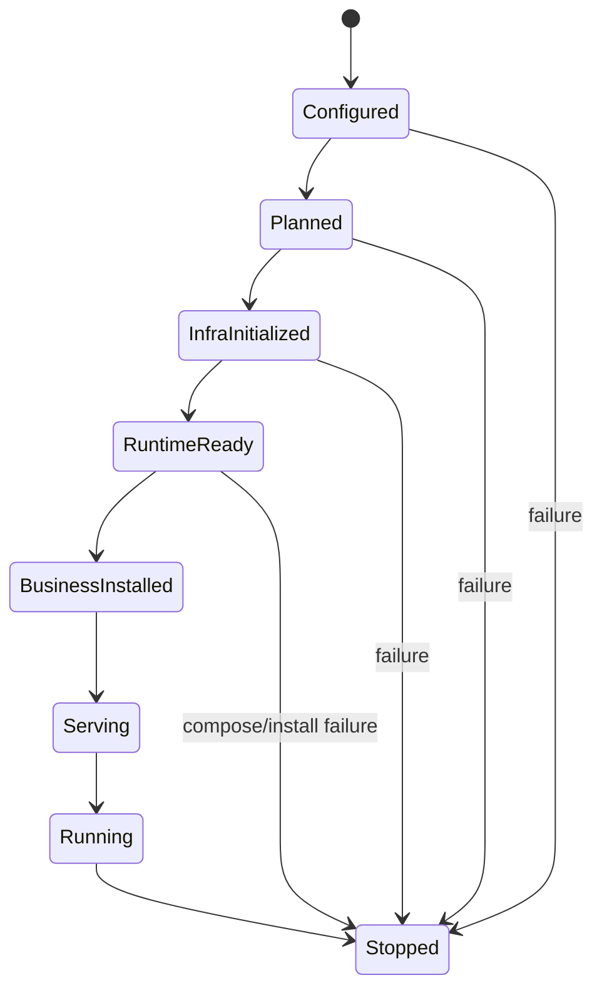
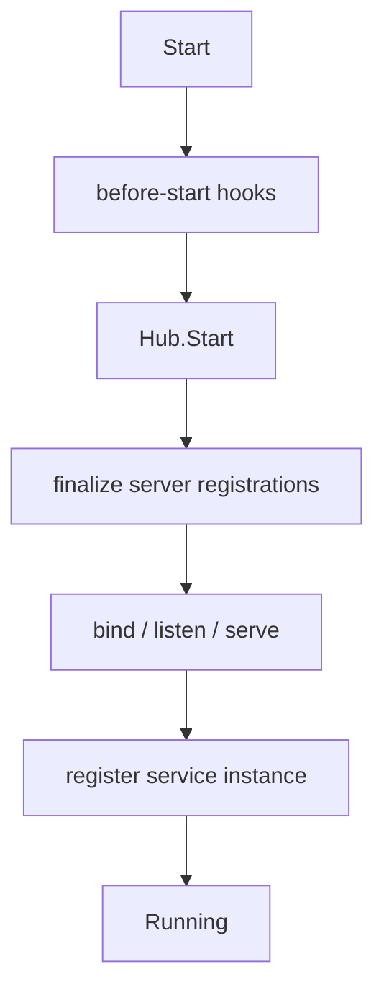
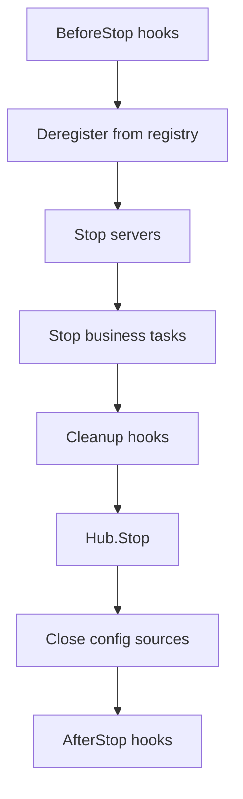
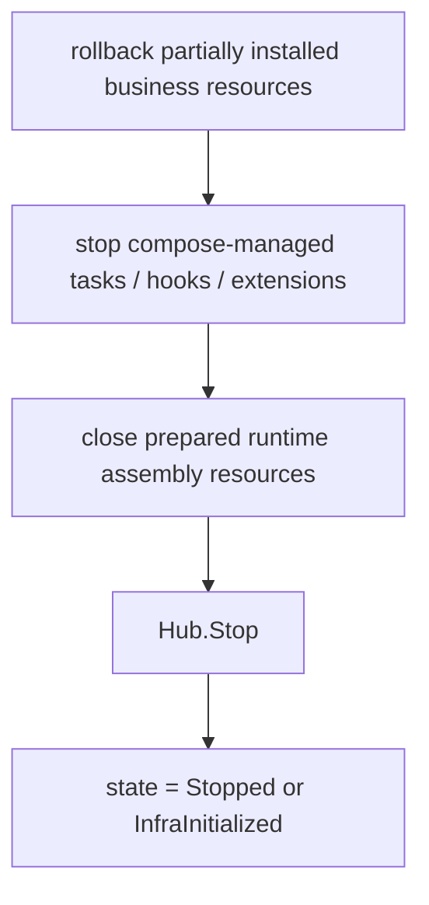

# 04. 应用生命周期与业务组合


> 本文说明 Yggdrasil v3 的 App 生命周期、Runtime 窄接口、BusinessBundle 模型、业务安装流程和优雅关闭语义。
>
> 关键词：App、Hub、Module、Capability、assembly.Spec、prepared runtime assembly、Prepare、Compose、BusinessBundle、Staged Reload。


## 1. 生命周期状态机

推荐高层状态机：



现有 App 细分状态也可以表达为：


`Stopped` 是终态，不支持进程内 restart。

## 2. 默认入口与高级入口

### 2.1 默认服务入口

`yggdrasil.Run(ctx, appName, compose, opts...)` 是推荐的默认服务接入路径。它把业务方首先接触到的入口收敛在 root facade，同时保持底层 `BusinessBundle` 安装边界不变：


这是业务服务最先应该看到的路径。

`appName` 是必填的代码级应用身份，必须传给 `Run` / `New`，不再从配置解析。

### 2.2 高级生命周期与独立 client 入口

`yggdrasil.New(appName, ...)` 与 `app.New(appName, ...)` 仍然保留给高级控制场景：显式 `Prepare`、`Compose`、`Install`、`Start`、`Wait`、`Stop`，以及 `app.New(appName, ...)->NewClient(...)` 这种独立 client bootstrap。

## 3. Prepare 阶段

`Prepare()` 必须完成：

- 加载配置并生成快照；
- 编译 settings / resolved；
- 解析 mode；
- 生成 `assembly.Spec`；
- prepare 内部 runtime assembly；
- `Hub.Use(...) + Seal()`；
- `Hub.Init()`；
- 构造 compose/install 所需 runtime 基础设施；
- 暴露 `Runtime` 窄接口。

硬约束：

- 不得 `Listen / Serve / Accept`；
- 不得注册服务实例；
- 不得接收业务请求；
- 只允许启动 internal-only helper；
- 所有对外 serve 动作必须推迟到 `Start()`。

## 4. Runtime 窄接口

`Runtime` 是业务组合阶段唯一推荐框架入口，不是 `*App` 也不是 `*Hub`。

```go
type Runtime interface {
    NewClient(ctx context.Context, service string) (client.Client, error)
    Config() *config.Manager
    Logger() *slog.Logger
    TracerProvider() trace.TracerProvider
    MeterProvider() metric.MeterProvider
    Identity() yggdrasil.Identity
    Lookup(target any) error
}
```

约束：

- 不暴露 `Stop / Reload / Hub / Modules` 等高权限接口；
- `Lookup(target)` 只允许解析 business-safe runtime façade；
- 不提供通用字符串 capability 查询；
- 业务优先使用 `NewClient / Config / Logger / TracerProvider / MeterProvider / Identity`。

## 5. Compose 阶段

业务通过闭包组合对象图：

```go
bundle, err := app.Compose(ctx, func(rt yapp.Runtime) (*yapp.BusinessBundle, error) {
    userClient, err := rt.NewClient(ctx, "user-service")
    if err != nil { return nil, err }
    svc := &OrderService{Users: userClient, Logger: rt.Logger()}
    return &yapp.BusinessBundle{
        RPCBindings: []yapp.RPCBinding{{
            ServiceName: "OrderService",
            Desc:        orderDesc,
            Impl:        svc,
        }},
    }, nil
})
```

框架不关心业务是否使用 Wire、Fx 或手写工厂；正式输出必须是 `BusinessBundle`。

## 6. BusinessBundle

```go
type BusinessBundle struct {
    RPCBindings  []RPCBinding
    RESTBindings []RESTBinding
    RawHTTP      []RawHTTPBinding
    Tasks        []BackgroundTask
    Hooks        []BusinessHook
    Extensions   []BusinessInstallable
    Diagnostics  []BundleDiag
}
```

| 字段 | 作用 |
|---|---|
| `RPCBindings` | 注册 RPC / gRPC 服务 |
| `RESTBindings` | 注册 REST gateway 服务 |
| `RawHTTP` | 注册原始 HTTP handler |
| `Tasks` | 交给生命周期 runner 管理的后台任务 |
| `Hooks` | before-start、before-stop、after-stop hook |
| `Extensions` | 标准绑定以外的正式安装扩展 |
| `Diagnostics` | 业务暴露的诊断项 |

## 7. InstallBusiness

`InstallBusiness(bundle)` 统一安装业务组合结果：

- 校验 RPC desc / impl 类型；
- 校验 REST desc / impl 类型；
- 校验 RawHTTP method/path/handler；
- 检查服务名与 route 冲突；
- 注册 tasks 和 hooks；
- 执行 `BusinessInstallable`；
- 收集 diagnostics。

### 7.1 RPCBinding

```go
type RPCBinding struct {
    ServiceName string
    Desc        any // must be *server.ServiceDesc
    Impl        any // must satisfy desc.HandlerType
}
```

校验：服务端 transport 必须存在；desc 非 nil；impl 非 nil；impl 实现 handler type；service name 不重复。

### 7.2 RESTBinding

```go
type RESTBinding struct {
    Name     string
    Desc     any
    Impl     any
    Prefixes []string
}
```

校验：REST 已启用；desc/impl 正确；method+path 不与其它 REST / RawHTTP 冲突。

### 7.3 RawHTTPBinding

```go
type RawHTTPBinding struct {
    Method  string
    Path    string
    Handler any
    Desc    *server.RestRawHandlerDesc
}
```

支持 legacy desc normalization；否则使用 method/path/handler。

## 8. Start / Serving / Running

`Start()` 发生在业务已安装后：



所有服务器通过 lifecycle runner 并发启动。任一 server 失败时触发 async stop。

## 9. Graceful Shutdown

关闭顺序：



默认 shutdown timeout 为 30 秒，可通过 `WithShutdownTimeout` 配置。

root `yggdrasil.Run` 会安装默认 OS signal handling，并基于父 context 与 shutdown signals 派生运行 context。宿主进程自行处理信号时使用 `WithSignalHandling(false)`，需要替换信号集合时使用 `WithShutdownSignals(...)`。底层 lifecycle runner 的 `Run` 与 `Stop` 都接收 context；`Stop` 会尊重已有 deadline，否则使用配置的 shutdown timeout 包裹关闭流程。

## 10. Compose / Install 失败补偿

如果 `Prepare` 成功后 `Compose` 或 `InstallBusiness` 失败：



关键要求：

- `Prepare()` 创建的 watcher、manager、exporter 等必须进入 prepared runtime assembly 关闭路径；
- `Compose` 闭包内部创建但未进入 BusinessBundle 的局部资源由业务自行释放；
- 需要跨 Start/Stop 生命周期存在的资源必须进入 Tasks/Hooks/Extensions。

## 11. Transport / Provider 二阶段契约

为了保证 `Prepare()` 不对外服务，transport/provider 作者必须遵守：

### Prepare 阶段允许

- 创建 provider；
- 创建 server object；
- 创建 handler registry、codec、mux；
- 创建未绑定 listener state；
- 启动 internal-only helper。

### Prepare 阶段禁止

- `Listen`；
- `Serve`；
- `Accept`；
- 注册服务实例；
- 启动面向外部请求的 worker loop。

### Start 阶段才允许

- bind / listen / serve；
- register-instance；
- 对外接收请求。
