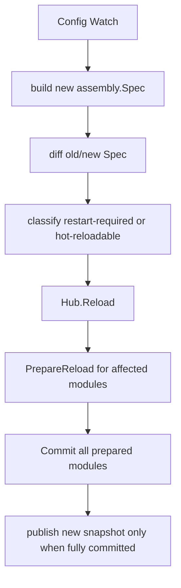

# 05. 配置、声明式装配与热重载


> 本文说明 Yggdrasil v3 的分层配置模型、声明式装配规划、spec diff 和 staged hot reload 语义。
>
> 关键词：App、Hub、Module、Capability、assembly.Spec、prepared runtime assembly、Prepare、Compose、BusinessBundle、Staged Reload。


## 1. 分层配置模型

Yggdrasil 使用不可变快照配置模型。`Manager` 持有多个具名 layer，每个 layer 有优先级。任一 layer 变化时，Manager 合并全部 layer，生成新的原子快照，并只通知订阅路径实际变化的 watcher。

优先级从低到高：

| 优先级 | 值 | 来源 |
|---|---:|---|
| `PriorityDefaults` | 0 | 硬编码默认值 |
| `PriorityFile` | 1 | YAML/JSON/TOML 文件 |
| `PriorityRemote` | 2 | 远程配置中心 |
| `PriorityEnv` | 3 | 环境变量 |
| `PriorityFlag` | 4 | 命令行参数 |
| `PriorityOverride` | 5 | 程序化 override |

合并规则：先按优先级升序，再按插入顺序升序；高优先级值覆盖低优先级值，map 使用 deep merge。

### 1.1 Source 加载

配置 layer 可以来自显式文件、声明式 source、环境变量、命令行参数和程序化 override。文件 bootstrap 来自 `WithConfigPath(...)` 或 bootstrap 配置 flag。如果没有加载配置文件、bootstrap source 或程序化配置 source，App 会安装默认 source：

- `YGGDRASIL` 前缀的环境变量 source，使用 `,` 解析数组，优先级为 `PriorityEnv`；
- 默认命令行 flag source，优先级为 `PriorityFlag`。

应用身份不属于配置树。请显式传给 `yggdrasil.Run(ctx, appName, ...)`、`yggdrasil.New(appName, ...)` 或 `app.New(appName, ...)`。

### 1.2 声明式配置 Source

配置 source 可以写在配置文件的 `yggdrasil.config.sources` 下，也可以在 bootstrap 阶段通过 `YGGDRASIL_CONFIG_SOURCES` / `--yggdrasil-config-sources` 声明。当配置文件位置或远程配置 source 本身也需要从 env / flag 发现时，应使用 bootstrap 声明。

bootstrap source 声明支持：

- JSON object：`{"kind":"env","priority":"env","config":{"prefixes":["APP"]}}`；
- JSON array，包含多个 source spec；
- 紧凑列表：`env:APP:env,flag::flag`。

内置 source kind：

| Kind | 作用 | 关键配置 |
|---|---|---|
| `file` | 加载 YAML/JSON/TOML 配置文件 | path 与 priority |
| `env` | 加载环境变量 | `prefixes`、`stripped_prefixes`、`parse_array`、`array_sep`、`ignored_vars` |
| `flag` | 加载命令行参数 | `ignored_names` |

内置 env source 默认忽略 `YGGDRASIL_CONFIG_SOURCES`。内置 flag source 默认忽略 `yggdrasil-config`、`yggdrasil-config-sources` 等 bootstrap flags，避免 bootstrap 控制项泄漏到应用配置快照。

自定义声明式 source 可以通过 `WithConfigSourceBuilder(kind, builder)` 注册，也可以由模块实现 `module.ConfigSourceProvider` 提供。context-aware builder 会收到构建该 source 前已经加载的快照，可用基础配置定位凭据、endpoint 或 namespace。

## 2. Snapshot 与 View

Snapshot 是不可变配置快照：

```go
type Snapshot struct { /* unexported */ }
```

关键方法：

| 方法 | 作用 |
|---|---|
| `Section(path ...string)` | 返回子快照 |
| `Decode(target any)` | 解码到结构体 |
| `Map()` | 返回 clone map |
| `Bytes()` | 返回 JSON 编码 |
| `Empty()` | 是否为空 |
| `Value()` | 返回规范化 clone |

View 是模块消费配置的 scoped lens：

```go
type View interface {
    Path() string
    Decode(target any) error
    Sub(path string) View
    Exists() bool
}
```

模块实现 `Configurable` 后，Hub 会自动按路径截取 view。

## 3. 声明式装配 Planner

Planner 是纯函数：输入配置快照、模块候选和 override，输出确定性的 `Result`：

- active modules；
- capability defaults；
- chain selections；
- canonical Spec；
- SHA-256 hash。

它不实例化运行时对象，只做决策。App 层消费 planner 结果，把模块注册到 Hub 并应用 runtime binding。

## 4. Planner Pipeline


### 4.1 resolveModules

- 处理 `DisableModule`；
- required modules 总是包含；
- 非 auto 模块默认包含；
- auto 模块根据 `AutoRule` 匹配；
- `EnableModule` 强制包含；
- 展开依赖闭包。

### 4.2 resolveDefaults

默认选择顺序：

```text
code ForceDefault
  -> config force_defaults
  -> explicit config
  -> mode default
  -> module fallback score
  -> framework fallback
```

无结果且存在多个 provider 时返回 `ErrAmbiguousDefault`。

### 4.3 resolveChains

链可以来自显式列表，也可以来自模板：

```yaml
yggdrasil:
  overrides:
    force_templates:
      rpc.interceptor.unary_server: default-observable@v1
```

展开后仍是显式 ordered names，再由 Hub 做 `ResolveOrdered`。

## 5. Spec / Hash / Diff / Explain

```go
type Spec struct {
    Identity  IdentitySpec
    Mode      Mode
    Modules   []ModuleRef
    Defaults  map[string]string
    Chains    map[string]Chain
    Decisions []Decision
    Warnings  []Warning
    Conflicts []Conflict
}
```

- `Hash(spec)`：对 canonical JSON 做 SHA-256。
- `Diff(oldSpec, newSpec)`：比较 mode、modules、defaults、chains、overrides。
- `Explain(spec)`：输出 pretty JSON，供 diagnostics 和 dry-run 查看。

## 6. 配置变更检测

模块级热重载通过比较模块配置路径下的新旧快照 JSON bytes：

```go
func configChanged(mod Module, oldSnap, newSnap config.Snapshot) bool {
    path := ""
    if item, ok := mod.(Configurable); ok { path = item.ConfigPath() }
    if path == "" { return false }
    parts := splitDotPath(path)
    return string(oldSnap.Section(parts...).Bytes()) != string(newSnap.Section(parts...).Bytes())
}
```

只有配置路径变化的模块进入 reload set，除非 `reloadAll`。

## 7. Staged Reload

完整热重载路径：



### 7.1 Prepare 失败

- 不进入 commit；
- 逆序 rollback 已 prepare 模块；
- rollback 失败进入 degraded。

### 7.2 Commit 失败

- 停止后续 commit；
- rollback 未 commit 但已 prepare 的模块；
- 标记 diverged / restart-required；
- 不承诺自动恢复旧世界。

### 7.3 Rollback 失败

- 记录 failed module 与 failed stage；
- 进入 `ReloadPhaseDegraded`；
- 暴露到 governor / diagnostics；
- 需要外部重启。

## 8. ReloadState

```go
type ReloadState struct {
    Phase           ReloadPhase
    RestartRequired bool
    Diverged        bool
    FailedModule    string
    FailedStage     ReloadFailedStage
    LastError       error
}
```

| Phase | 描述 |
|---|---|
| `idle` | 正常运行 |
| `preparing` | 准备 reload |
| `committing` | 提交新状态 |
| `rollback` | 回滚失败阶段 |
| `degraded` | 不可自动恢复，需要重启 |

## 9. Restart-Required 判定

以下场景应标记 restart-required：

- 模块新增 / 删除；
- capability 默认实现变化且无法平滑切换；
- 不支持 reload 的模块配置变化；
- BusinessBundle 结构变化；
- 服务绑定变化需要重建业务图；
- staged reload 进入 degraded；
- 首版 reload 中任何需要重新执行 `Compose` 的变化。

## 10. 配置示例

```yaml
yggdrasil:
  mode: prod-grpc
  server:
    transports:
      - "grpc"
  transports:
    grpc:
      server:
        address: ":9090"
    http:
      rest:
        host: "0.0.0.0"
        port: 8080
  observability:
    logging:
      handlers:
        default:
          type: json
      writers:
        default:
          type: console
    telemetry:
      tracer: otel
      meter: otel
  discovery:
    registry:
      type: multi_registry
  extensions:
    interceptors:
      unary_server: default-observable@v1
  overrides:
    force_defaults:
      observability.logger.handler: json
    disable_modules:
      - observability.stats.otel
```

## 11. 运维排障建议

- 先看 plan hash 是否变化；
- 再看 Spec Diff 属于 module/default/chain/config 哪类；
- 若 restart-required，检查是否涉及业务图或不可 reload 模块；
- 若 degraded，优先查看 failed module / failed stage；
- 若 AmbiguousDefault，显式配置 provider 或禁用候选模块；
- 若 UnknownExplicitBinding，检查模块是否被 planner 启用。
