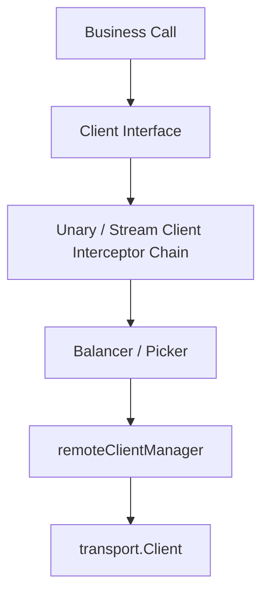

# 06. 传输、服务发现与可观测性


> 本文说明 Yggdrasil v3 的协议无关传输模型、REST Gateway、安全 Profile、注册发现、负载均衡、拦截器、中间件和可观测性集成。
>
> 关键词：App、Hub、Module、Capability、assembly.Spec、prepared runtime assembly、Prepare、Compose、BusinessBundle、Staged Reload。


## 1. 协议无关传输模型

Yggdrasil 通过 transport provider 解耦 RPC 框架与具体网络协议。服务端和客户端 transport 都作为 capability 注册，由装配计划和 Hub 选择。

```go
type TransportServerProvider interface {
    Protocol() string
    NewServer(handle MethodHandle) (Server, error)
}

type TransportClientProvider interface {
    Protocol() string
    NewClient(
        ctx context.Context,
        serviceName string,
        endpoint resolver.Endpoint,
        statsHandler stats.Handler,
        onStateChange OnStateChange,
    ) (Client, error)
}
```

Hub 只持有 provider；具体 server/client 实例由对应 runtime 子系统创建和管理。

## 2. Server / Client 抽象

### 2.1 Server

```go
type Server interface {
    Start() error
    Handle() error
    Stop(context.Context) error
    Info() ServerInfo
}
```

- `Start`：绑定并开始监听；
- `Handle`：阻塞处理请求，通常由 errgroup 调用；
- `Stop`：优雅关闭；
- `Info`：返回协议、地址和属性。

### 2.2 Client

```go
type Client interface {
    NewStream(ctx context.Context, desc *stream.Desc, method string) (stream.ClientStream, error)
    Close() error
    Protocol() string
    State() State
    Connect()
}
```

连接状态：`Idle -> Connecting -> Ready -> TransientFailure -> Shutdown`。

## 3. REST Gateway 与 Raw HTTP

业务可以同时注册：

- RPC service desc；
- REST service desc；
- Raw HTTP handler。

REST 与 Raw HTTP 的 route 冲突必须在安装阶段检查，冲突维度通常是 method + path。

## 4. 安全 Profile

安全系统采用 Provider -> Profile -> Material 管线：

```go
type Provider interface {
    Type() string
    Compile(name string, raw map[string]any) (Profile, error)
}

type Profile interface {
    Name() string
    Type() string
    Build(spec BuildSpec) (Material, error)
}
```

`Material` 包含 TLS 配置、请求认证器和连接认证器：

```go
type Material struct {
    Mode        Mode
    ClientTLS   *tls.Config
    ServerTLS   *tls.Config
    RequestAuth RequestAuthenticator
    ConnAuth    ConnAuthenticator
}
```

安全模式：

| Mode | 描述 |
|---|---|
| `insecure` | 无加密与认证 |
| `local` | 本地安全策略 |
| `tls` | TLS / 可选 mTLS |

## 5. 服务注册 Registry

```go
type Registry interface {
    Register(context.Context, Instance) error
    Deregister(context.Context, Instance) error
    Type() string
}
```

应用启动后注册实例，优雅关闭时注销实例。`multi_registry` 可以把注册/注销 fan-out 到多个后端，并支持 fail-fast 策略。

## 6. 服务发现 Resolver

```go
type Resolver interface {
    AddWatch(serviceName string, client Client) error
    DelWatch(serviceName string, client Client) error
    Type() string
}
```

Resolver 观察服务 endpoint 变化，并通过 client callback 更新状态。resolver watch 是动态对象，不注册到 Hub。

## 7. 负载均衡 Balancer / Picker

```go
type Balancer interface {
    UpdateState(resolver.State)
    Close() error
    Type() string
}

type Picker interface {
    Next(RPCInfo) (PickResult, error)
}
```

内置 round-robin 使用 atomic counter 选择下一个可用 endpoint。Balancer 运行时状态属于 client 子系统，不进入 Hub。

## 8. RPC 客户端调用链



Hub 只提供 resolver provider、balancer provider、transport client provider、credentials provider、client interceptor provider。

## 9. 拦截器与 Middleware

链式扩展点由三部分组成：

1. 模块提供具名 provider；
2. 配置给出最终有序名称列表或模板；
3. 子系统按顺序解析并组链。

执行顺序只来自配置，不来自模块注册顺序、DAG、`InitOrder()` 或 map 遍历。

```go
ints, err := module.ResolveOrdered[interceptor.UnaryServerInterceptorProvider](
    hub,
    capabilities.UnaryServerInterceptorSpec,
    resolved.OrderedExtensions.UnaryServer,
)
```

## 10. 可观测性

### 10.1 Logger

日志系统拆为 handler builder、writer builder 和 logger core。内置 logger handler / writer capability 是 `NamedOne`；runtime 通过显式 capability binding 解析配置中的名称，不能取第一个。

### 10.2 Tracer / Meter

TracerProvider 与 MeterProvider builder 是 `NamedOne` capability，分别由 `yggdrasil.observability.telemetry.tracer` 和 `yggdrasil.observability.telemetry.meter` 选择。存在多个可用 provider 是合法的；选择了不存在的 provider 才会在规划或 runtime prepare 阶段失败。

### 10.3 Stats Handler

Stats handler builder 是 `NamedOne` capability。server/client runtime 根据 telemetry stats 配置构建各自的 handler chain。

### 10.4 Diagnostics

Governor 应暴露：

- 拓扑序和拓扑层级；
- capability 冲突；
- reload state；
- restart-required；
- plan hash 与 spec diff；
- transport server info；
- registry / resolver / balancer 状态摘要。

## 11. 自定义 Transport 模块示例

```go
type MyTransportModule struct{}

func (m *MyTransportModule) Name() string { return "transport.my_protocol" }

func (m *MyTransportModule) Capabilities() []module.Capability {
    return []module.Capability{
        {
            Spec: capabilities.TransportServerProviderSpec, // NamedOne
            Name: "my_protocol",
            Value: transport.NewTransportServerProvider(
                "my_protocol",
                func(handle transport.MethodHandle) (transport.Server, error) {
                    return newMyServer(handle), nil
                },
            ),
        },
        {
            Spec: capabilities.TransportClientProviderSpec, // NamedOne
            Name: "my_protocol",
            Value: transport.NewTransportClientProvider(
                "my_protocol",
                func(ctx context.Context, service string, endpoint resolver.Endpoint, stats stats.Handler, onChange transport.OnStateChange) (transport.Client, error) {
                    return newMyClient(ctx, service, endpoint), nil
                },
            ),
        },
    }
}
```

配置：

```yaml
yggdrasil:
  server:
    transports:
      - "my_protocol"
  transports:
    my_protocol:
      server:
        address: ":9090"
```
