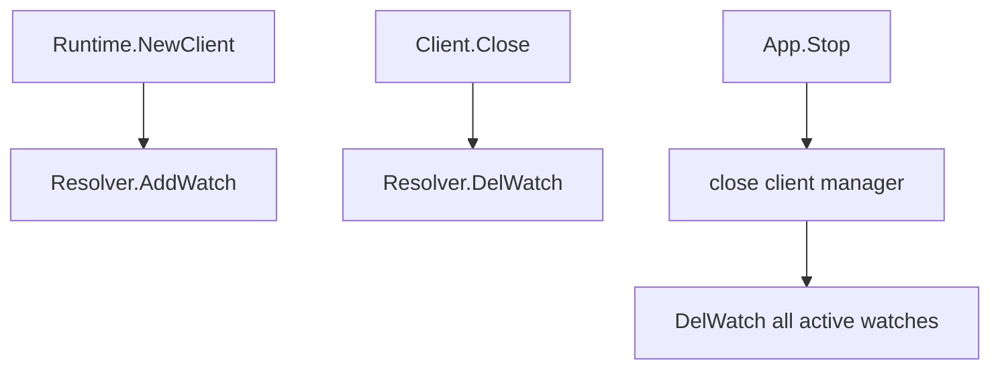

# 08. 实施边界与优化补充

> 本文补充新版文档集的工程落地约束：实现状态、测试清单、错误格式、首版 hot reload 边界和生产故障语义。

## 1. 文档状态标记

建议每篇文档顶部或 README 状态表中维护以下状态：

| 状态 | 含义 |
|---|---|
| `Implemented` | 已实现并有测试覆盖 |
| `Experimental` | 可用但 API 可能调整 |
| `Design Baseline` | 设计已确认，代码可能分阶段落地 |
| `Proposal` | 仍需评审 |
| `Guide` | 实践指南或维护指南 |

Bootstrap / Auto Assembly / Compose / Install 层是 Yggdrasil v3 设计基线的一部分。若实现分阶段交付，应在 release note 中说明哪些能力已实现，哪些仍为 proposal。

## 2. 推荐阅读路径

| 角色 | 推荐顺序 | 目标 |
|---|---|---|
| 业务应用开发者 | 00 -> 07 -> 04 -> 05 -> 06 | 快速接入服务、理解生命周期和配置 |
| 模块作者 | 00 -> 02 -> 03 -> 07 -> 05 | 实现 Module、Capability 和自动装配 |
| 框架维护者 | 00 -> 01 -> 02 -> 03 -> 04 -> 05 -> 06 | 维护核心架构、生命周期和 runtime 边界 |
| 运维人员 | 00 -> 05 -> 07 -> 02 | 排查配置、reload、diagnostics 和启动失败 |

## 3. Hub 测试 Checklist

Hub 实现至少应覆盖以下测试：

- missing dependency：依赖目标不存在时输出可排障错误；
- dependency cycle：存在环时输出完整环路径；
- stable topo ordering：同层按 `InitOrder()` 和名称稳定排序；
- start failure compensation：启动失败时逆序停止已启动模块；
- stop idempotency：重复 Stop 不重复释放资源；
- capability cardinality：`ExactlyOne` / `OptionalOne` / `NamedOne` 基数冲突；
- resolve ordered：重复名称、缺失 provider、类型不匹配必须失败；
- scope rejection：拒绝 `ScopeRuntimeFactory` 模块进入 Hub。

推荐错误信息：

```text
stage=Seal target=capability:observability.logger.handler reason=CardinalityViolation
spec=NamedOne name=json
providers=observability.logger.json.default, custom.logger.json
fix=rename one provider, disable one module, or configure an explicit binding
```

## 4. Decision / Warning / Conflict 推荐结构

```go
type Decision struct {
    Stage      string   `json:"stage"`
    Target     string   `json:"target"`
    Selected   string   `json:"selected,omitempty"`
    Source     string   `json:"source"`
    Reason     string   `json:"reason"`
    Candidates []string `json:"candidates,omitempty"`
}
```

示例：

```json
{
  "stage": "resolveDefaults",
  "target": "observability.telemetry.tracer",
  "selected": "otel",
  "source": "mode-default",
  "reason": "mode prod-grpc selects otel tracer",
  "candidates": ["noop", "otel"]
}
```

`Warning` 和 `Conflict` 也应包含 `stage`、`target`、`reason`、`fix`，并按 stable key 排序输出。

## 5. 生命周期失败恢复矩阵

| 失败阶段 | 可能已创建资源 | 框架应执行 | 推荐最终状态 |
|---|---|---|---|
| Plan | 无 runtime 资源 | 返回错误 | Stopped |
| Seal | Hub 已收集模块 | 丢弃计划和临时 Hub | Stopped |
| Init | 部分模块完成 Init | 停止或关闭已初始化资源 | Stopped |
| Prepare runtime | 部分 runtime 资源 | 执行 prepared runtime assembly close path | Stopped |
| Compose | runtime ready，业务局部资源可能存在 | 关闭框架管理资源；业务局部资源由业务负责 | Stopped / InfraInitialized |
| InstallBusiness | 部分业务 binding、task、hook | rollback business install，再 Hub.Stop | Stopped |
| Start | 部分模块或 server started | async stop，逆序补偿 | Stopped |

实现应保证所有补偿路径可重复调用，并将多个关闭错误聚合返回。

## 6. 首版 Hot Reload 支持边界

支持：

- 单模块配置变更，且模块实现 `Reloadable`；
- logger level / writer 参数变更；
- telemetry exporter 参数变更；
- registry / resolver client 参数变更，前提是 provider 支持 staged reload。

不支持，需标记 `restart-required`：

- 新增或删除模块；
- transport 协议变化；
- server port / listener 变化；
- RPC / REST / RawHTTP binding 变化；
- `BusinessBundle` 结构变化；
- 任何需要重新执行 `business.Compose` 的变化。

## 7. 配置路径规范

模块配置路径建议使用 `yggdrasil.<subsystem>.<module>` 风格。框架保留以下顶层路径：

- `yggdrasil.server`
- `yggdrasil.transports`
- `yggdrasil.observability`
- `yggdrasil.discovery`
- `yggdrasil.extensions`
- `yggdrasil.overrides`

第三方模块应避免占用框架保留路径，必要时使用 `yggdrasil.modules.<vendor>.<module>`。

## 8. 生产故障语义补充

### 8.1 multi_registry 策略

| 策略 | 语义 |
|---|---|
| `fail_fast` | 任一 registry 注册失败则整体失败，并回滚已注册实例 |
| `best_effort` | 记录 diagnostics，但允许服务继续运行 |

### 8.2 Resolver Watch 生命周期



Resolver watch 属于 client runtime 动态状态，不得注册到 Hub。

### 8.3 Security Profile Reload

- TLS 证书轮换：可支持 hot reload；
- RequestAuth 规则变化：取决于认证 provider 是否实现 staged reload；
- mTLS CA 或安全模式变化：通常应标记 restart-required，除非 provider 明确支持无损切换。

## 9. 最小评审清单

提交新模块或 provider 前，至少确认：

- 是否破坏 App-local 隔离；
- 是否在 Prepare 阶段对外监听；
- capability 是否有明确 cardinality；
- 默认选择是否可 explain；
- reload 失败是否可 rollback 或标记 restart-required；
- diagnostics 是否包含足够排障信息。
